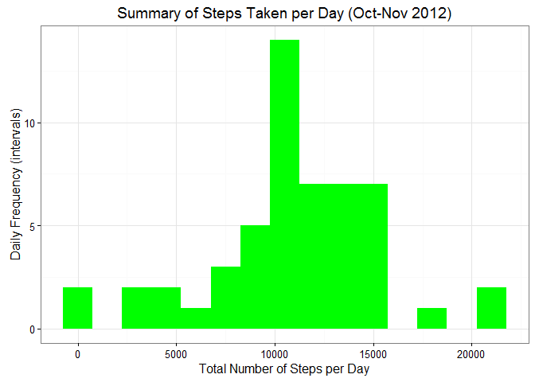
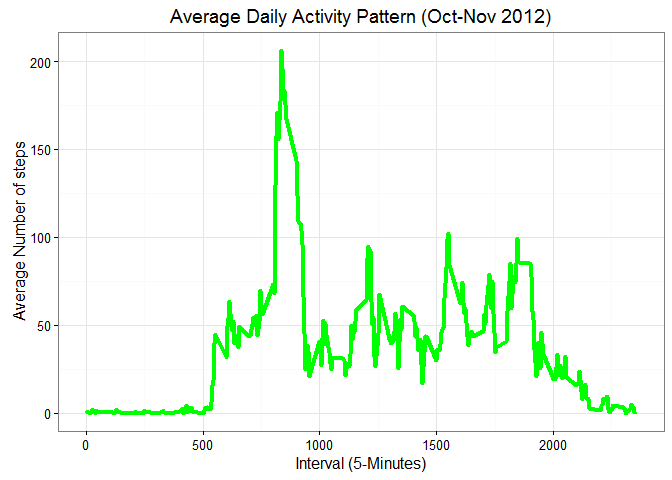
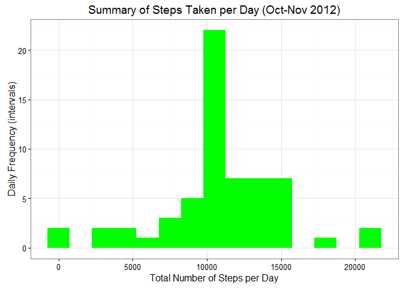
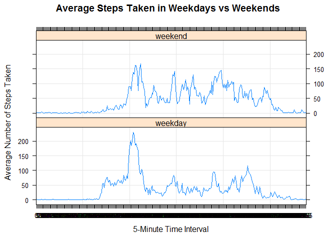

Reproducible Research: Peer Assessment 1
========================================

### 1. Load the data from course website; (i.e. read.csv())

    activity<- read.csv("activity.csv")

### 2. Process/transform the data (if necessary) into a format suitable for your analysis

    activity$date <- as.Date(activity$date, format = "%Y-%m-%d")
    activity$interval <- as.factor(activity$interval)

What is mean total number of steps taken per day?
-------------------------------------------------

### 1.Calculate the total number of steps taken per day.

    steps_daily <- aggregate(steps ~ date, activity, sum)
    colnames(steps_daily) <- c("date","steps")
    head(steps_daily)

    ##         date steps
    ## 1 2012-10-02   126
    ## 2 2012-10-03 11352
    ## 3 2012-10-04 12116
    ## 4 2012-10-05 13294
    ## 5 2012-10-06 15420
    ## 6 2012-10-07 11015

### 2. Make a histogram of the total number of steps taken each day.

    library(ggplot2)

    ## Warning: package 'ggplot2' was built under R version 3.2.5

    ggplot(steps_daily, aes(x = steps)) + 
           geom_histogram(fill = "green", binwidth = 1500) + 
            labs(title="Summary of Steps Taken per Day (Oct-Nov 2012)", 
            x = "Total Number of Steps per Day", y = "Daily Frequency (intervals)" ) +theme_bw()

### 3. Calculate and report the mean and median of the total number of steps taken per day

    mean_steps_daily   <- mean(steps_daily$steps, na.rm=TRUE)
    median_steps_daily <- median(steps_daily$steps, na.rm=TRUE)

Print:

    mean_steps_daily

    ## [1] 10766.19

    median_steps_daily

    ## [1] 10765

The average (mean) steps taken per day is 10766.19 while the median is
10765.

What is the average daily activity pattern?
-------------------------------------------

Prior to plotting, convert the steps taken by the 5-minute intervals
into integers

    interval_steps <- aggregate(activity$steps, 
                      by = list(interval = activity$interval),
                      FUN=mean, na.rm=TRUE)

    interval_steps$interval <- as.integer(levels(interval_steps$interval)[interval_steps$interval])
            as.integer(levels(interval_steps$interval)[interval_steps$interval])

    ## integer(0)

    colnames(interval_steps) <- c("interval", "steps")

### 1. Make a time series plot (i.e. type = "l") of the 5-minute interval (x-axis) and the average number of steps taken, averaged across all days (y-axis)

    ggplot(interval_steps, aes(x=interval, y=steps)) +   
            geom_line(color="green", size=1.5) +  
            labs(title="Average Daily Activity Pattern (Oct-Nov 2012)", x="Interval (5-Minutes)", y="Average Number of steps") +  
            theme_bw()

### 2. Which 5-minute interval, on average across all the days in the dataset, contains the maximum number of steps?

    max_interval_steps <- interval_steps[which.max(interval_steps$steps),]
    print(max_interval_steps)

    ##     interval    steps
    ## 104      835 206.1698

The 835th interval has the most steps taken at 206 steps.

Imputing Missing Values
-----------------------

To address possible bias caused by missing values (NA), identify the
number of missing values and device a strategy to fill out these values.
Create a new (modified) dataset that integrates the new values.

### 1. Total number of missing values:

Calculate and report the total number of missing values in the dataset
(i.e. the total number of rows with NAs)

    missing_steps <- sum(is.na(activity$steps))
    print(missing_steps)

    ## [1] 2304

There are a total of 2304 missing values.

### 2. Fill the missing values and create a new dataset with the proxy values

Devise a strategy for filling in all of the missing values in the
dataset. The strategy does not need to be sophisticated. For example,
you could use the mean/median for that day, or the mean for that
5-minute interval, etc.

    na_steps_proxy <- function(data, pervalue) {
            na_list <- which(is.na(data$steps))
            na_proxy <- unlist(lapply(na_list, FUN=function(idx){
                    interval = data[idx,]$interval
                    pervalue[pervalue$interval == interval,]$steps
            }))
            proxy_na_steps <- data$steps
            proxy_na_steps[na_list] <- na_proxy
            proxy_na_steps
    }

    activity_proxy <- data.frame(  
            steps = na_steps_proxy(activity, interval_steps),  
            date = activity$date,  
            interval = activity$interval)

Check if there still missing values in the new dataset: activity\_proxy.

    missing_steps_new <- sum(is.na(activity_proxy$steps))
    print(missing_steps_new)

    ## [1] 0

    str(activity_proxy)

    ## 'data.frame':    17568 obs. of  3 variables:
    ##  $ steps   : num  1.717 0.3396 0.1321 0.1509 0.0755 ...
    ##  $ date    : Date, format: "2012-10-01" "2012-10-01" ...
    ##  $ interval: Factor w/ 288 levels "0","5","10","15",..: 1 2 3 4 5 6 7 8 9 10 ...

### 3. Plot a histogram of the total number of steps taken each day

Plot a historgram of the total number of steps taken per day with the
proxy values

    steps_daily_proxy<- aggregate(steps ~ date, activity_proxy, sum)
    colnames(steps_daily_proxy) <- c("date","steps")

    ggplot(steps_daily_proxy, aes(x = steps)) + 
           geom_histogram(fill = "green", binwidth = 1500) + 
            labs(title="Summary of Steps Taken per Day (Oct-Nov 2012)", 
                 x = "Total Number of Steps per Day", y = "Daily Frequency (intervals)") + theme_bw() 

Calculate the new mean and median of the data set with proxy values

    mean_steps_daily_proxy   <- mean(steps_daily_proxy$steps, na.rm=TRUE)
    median_steps_daily_proxy <- median(steps_daily_proxy$steps, na.rm=TRUE)
    print(mean_steps_daily_proxy)

    ## [1] 10766.19

    print (median_steps_daily_proxy)

    ## [1] 10766.19

Note that the new mean and median are now equal at 10766.189; compared
to the previous dataset with missing values. However, it is important to
note that the value of the mean has not changed thus replacing the
missing values has no impact on the estimates of computing the total
daily number of steps.

Are there differences in activity patterns between weekdays and weekends?
-------------------------------------------------------------------------

### 1.) Using the new dataset, add a new column indicating what type of day the observations were taken (Weekday or weekend)

    activity_proxy$dateType <-  ifelse(as.POSIXlt(activity_proxy$date)$wday %in% c(0,6), 'weekend', 'weekday')

    head(activity_proxy)

    ##       steps       date interval dateType
    ## 1 1.7169811 2012-10-01        0  weekday
    ## 2 0.3396226 2012-10-01        5  weekday
    ## 3 0.1320755 2012-10-01       10  weekday
    ## 4 0.1509434 2012-10-01       15  weekday
    ## 5 0.0754717 2012-10-01       20  weekday
    ## 6 2.0943396 2012-10-01       25  weekday

### 2.) Plot a graph that would show if there is any difference in the activity by type of day.

    activitybydaytype<- aggregate(steps ~ interval + dateType, activity_proxy, mean)

    library(lattice)
    xyplot(steps ~ interval|dateType, data = activitybydaytype,
           type = "l", layout = c(1,2),
           grid = TRUE,
                  xlab="5-Minute Time Interval", ylab = "Average Number of Steps Taken",
           main= "Average Steps Taken in Weekdays vs Weekends")

The graph shows that activity during weekdays has the highest peak but
weekends have more frequent peaks.
